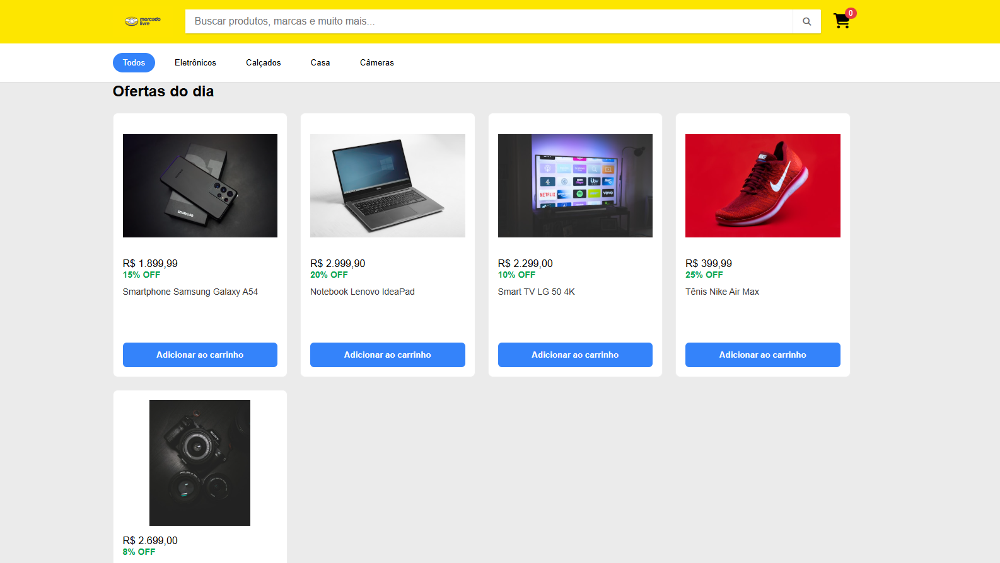

# 🛒 Mercado Livre Clone - Ofertas do Dia


Uma reprodução visual da interface de listagem de produtos do **Mercado Livre**, focada na seção de "Ofertas do Dia". Este projeto exercita a construção de layouts modernos, grids responsivos e componentes de e-commerce.

---

## 🎨 Interface

A interface conta com um header funcional, sistema de filtros por categoria e uma grade de produtos que exibe informações dinâmicas como preços e descontos.



---

## 🚀 Tecnologias

As seguintes ferramentas foram utilizadas na construção do projeto:

* **HTML5**: Estruturação semântica.
* **CSS3**: Estilização (Flexbox e Grid Layout).
* **Google Fonts**: Tipografia customizada para maior fidelidade.

## 🛠️ Funcionalidades

* [x] **Header Identitário**: Barra de busca centralizada e ícone de carrinho.
* [x] **Menu de Categorias**: Navegação rápida entre departamentos.
* [x] **Cards de Produto**:
    * Cálculo visual de descontos (ex: 20% OFF).
    * Botões de ação com feedback visual.
* [ ] **Responsividade**: (Em andamento) Adaptação para dispositivos mobile.

## 📦 Como Visualizar

Para ver o projeto localmente, siga estes passos:

1. Clone o repositório:
   ```bash
   git clone [https://github.com/seu-usuario/ml-clone-interface.git](https://github.com/seu-usuario/ml-clone-interface.git)
